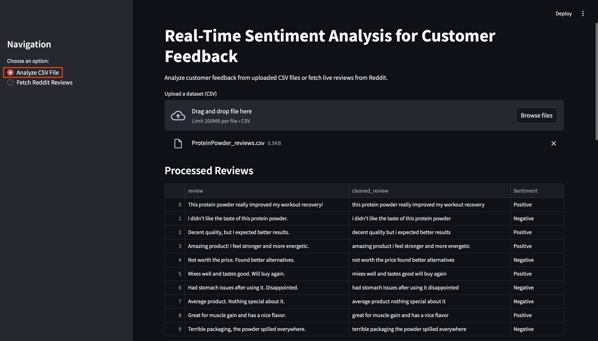
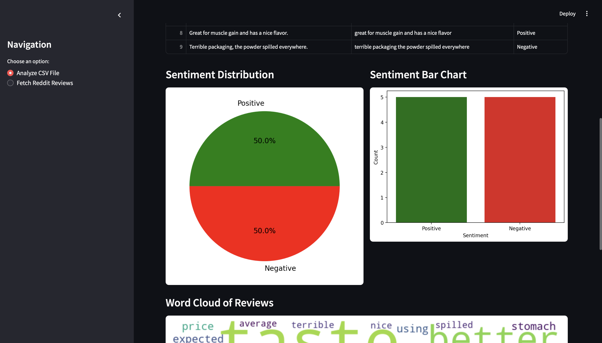
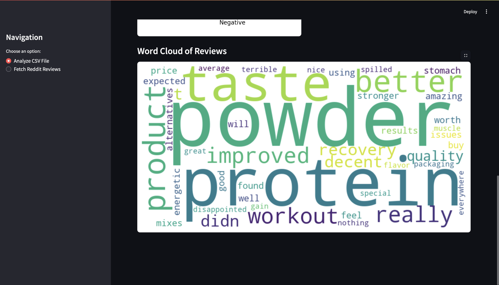
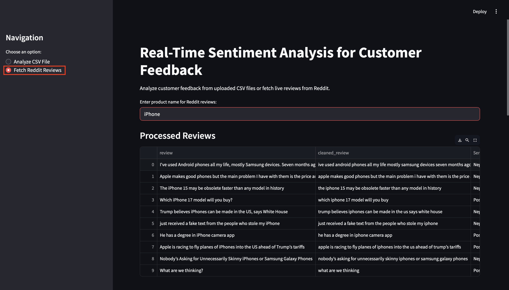
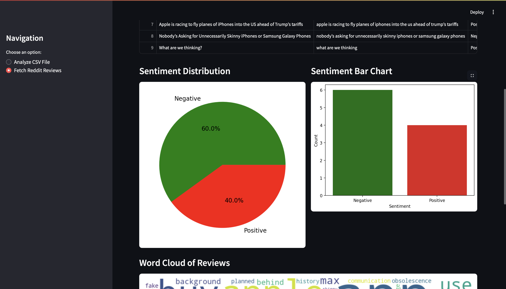
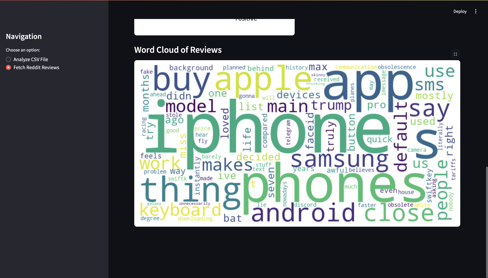

# Real-Time Sentiment Analysis for Customer Feedback

# RA2211027010088 - PRATYUSH KUMAR SINGH

This project enables users to analyze customer sentiments in real time. Users can upload a CSV file containing customer reviews or fetch live discussions from Reddit. The application cleans and preprocesses the text, performs sentiment analysis using BERT, and provides interactive visualizations including sentiment distribution charts and word clouds.

---

## Features

- **CSV File Analysis:** Upload a CSV file containing customer reviews. The app automatically cleans the text and classifies it into Positive, Negative, or Neutral sentiment.
- **Live Reddit Reviews:** Fetch live discussions from Reddit based on a given product name. The app processes and analyzes the results in real time.
- **Interactive Visualizations:**

  - **Data Table:** Displays the processed reviews.
  - **Pie Chart:** Visualizes sentiment distribution.
  - **Bar Chart:** Provides comparative sentiment counts.
  - **Word Cloud:** Highlights the most frequent terms in the reviews.

## Sample Data

### **customer_review.csv** (Located in `data/`)

| review                                                    |
| --------------------------------------------------------- |
| "I absolutely love this product! It has changed my life." |
| "Worst purchase ever. The product broke within a week."   |
| "It was okay, nothing spectacular but did the job."       |

### **cleaned_reviews.csv** (Located in `data/`)

| review                                                    | cleaned_review                                          | Sentiment |
| --------------------------------------------------------- | ------------------------------------------------------- | --------- |
| "I absolutely love this product! It has changed my life." | "i absolutely love this product it has changed my life" | Positive  |
| "Worst purchase ever. The product broke within a week."   | "worst purchase ever the product broke within a week"   | Negative  |
| "It was okay, nothing spectacular but did the job."       | "it was okay nothing spectacular but did the job"       | Neutral   |

---

## Screenshots:

## 1. Get Review Sentiment through CSV File

1. Choose **Analyze CSV File**
2. Upload CSV File
3. Enter

## 2. Get Review Sentiment through Product Name

1. Choose **Fetch Reddit Reviews**
2. Enter Product Name
3. Enter

